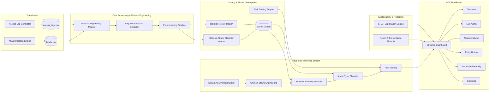

# System Architecture Diagram

## Architecture Summary

- Synthetic and labeled cybersecurity data are generated first.
- Feature engineering transforms raw events into behavior and anomaly features.
- Isolation Forest learns normal behavior and detects anomalies.
- XGBoost classifies the nature of detected attacks.
- Risk scoring combines model confidence, behavioral deviations, and suspicious activity signals.
- SHAP explainability provides interpretable reasons for each alert.
- A Streamlit-based SOC dashboard visualizes live alerts and analytics.
